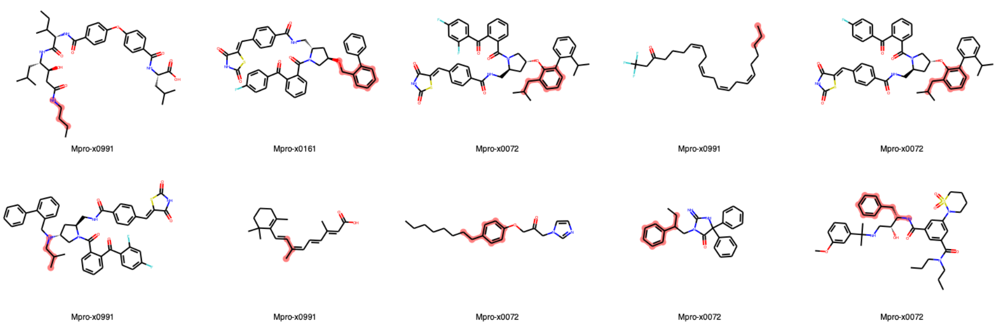
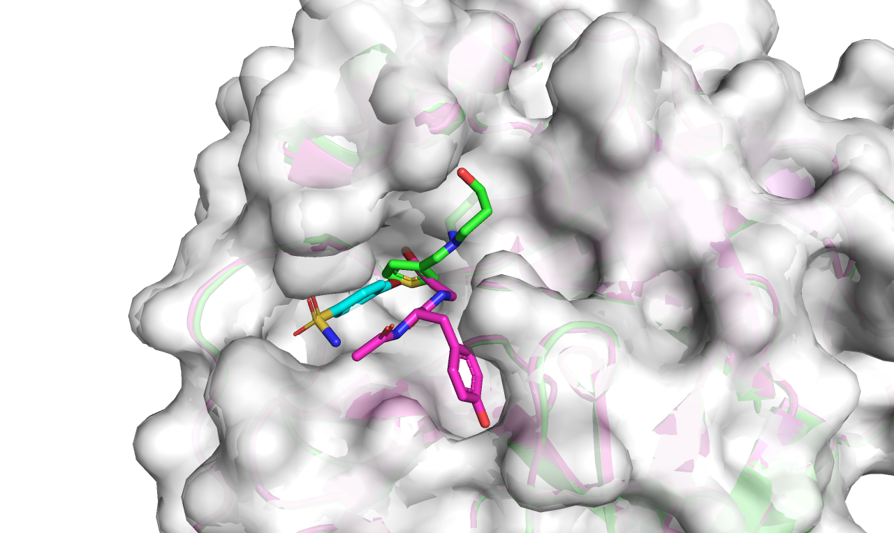
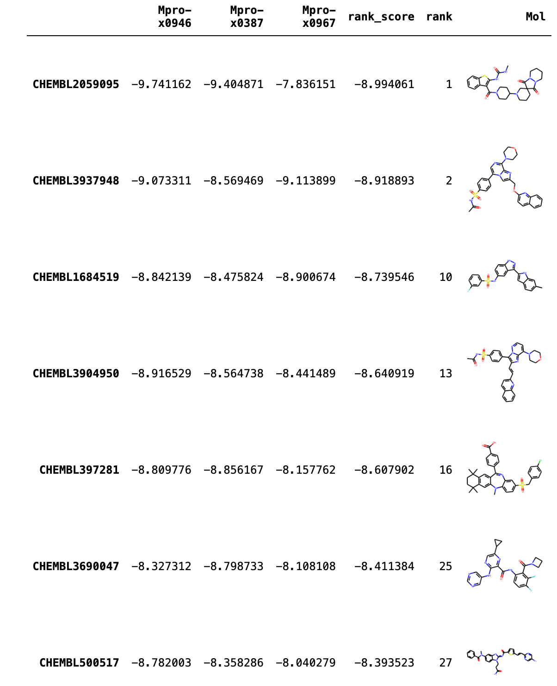

# Docking screening for focused library filtered from similar proteins
In this pipeline, a docking-based screening was implemented with the SARS-CoV-2 focused ChEMBL library, which filtered from similar proteins, to search the hit compounds.

First, the focused library was generated (see [here](https://github.com/volkamerlab/covid19-SBapproach/tree/master/code/focused_library_similar_proteins)).
Next, the focused library was filtered by the maximum common substructure (MCS) fragment strategy. Only those molecules having some resemblance with the original fragments were chosen (see [here](https://github.com/volkamerlab/covid19-SBapproach/tree/master/notebooks/filter_screeningdeck_by_fragment_similarity.ipynb)).
Finally, the docking-based screening was applied to the filtered library (see [here](https://github.com/volkamerlab/covid19-SBapproach/tree/master/code/docking)).

## Pipeline

### Step 1 ([scripts](https://github.com/volkamerlab/covid19-SBapproach/tree/master/code/focused_library_similar_proteins))

Generate the SARS-CoV-2 focused ChEMBL library. It contains 4121 compounds and can be found [here](https://github.com/volkamerlab/covid19-SBapproach/tree/master/data/focused_library_similar_proteins/focused_library.csv).

### Step 2 ([scripts](https://github.com/volkamerlab/covid19-SBapproach/tree/master/notebooks/filter_screeningdeck_by_fragment_similarity.ipynb))

Filter the focused library with the MCS fragment strategy.

1. Choose the focused library as screening deck.
2. Choose the 22 [non-covalent fragments](https://github.com/volkamerlab/covid19-SBapproach/tree/master/data/fragments/non_covalent_fragments2D.sdf) as fragment set.

   

3. Get MCS between compounds and fragments and store the best-match fragment for per compound. Part of compounds with the best-match fragment highlighting:

   

4. Store dataset filtered by similarity to fragment or MCS with fragment.
    * Set `cut-off = 0.75` for the similarity filtering.

    In this case, 916 compounds are filtered.
    ```
    mcsFragName   number
    Mpro-x0995    760
    Mpro-x0305     83
    Mpro-x0107     45
    Mpro-x0387     37
    Mpro-x0946     35
    Mpro-x0967      1
    ```
    The dataset was saved as [`focused_library_mcs075.csv`](https://github.com/volkamerlab/covid19-SBapproach/tree/master/focused_library_docking_screening_pipeline/result_data/focused_library_mcs075.csv)
5. Control the number of compounds and receptor structures.
    * Compounds

        MCS fragments that match more than 50 compounds are usually small fragments.

        We control the number of compounds for each MCS fragment so they don't exceed 50. The dataset was saved as [`focused_library_mcs075_controled.csv`](https://github.com/volkamerlab/covid19-SBapproach/tree/master/focused_library_docking_screening_pipeline/result_data/focused_library_mcs075_controled.csv)

    * Receptor structures

        Given the time restrictions, only three structures were chosen for molecular docking. The corresponding fragment ligands for the chosen structures should be big enough to bind to the receptor in different subpockets.

        For this pipeline, we chose structures `Mpro-x0387`, `Mpro-x0946` and `Mpro-x0967`.
        

### Step 3 ([scripts](https://github.com/volkamerlab/covid19-SBapproach/tree/master/code/docking))

Molecular docking screening with [`smina`](https://sourceforge.net/projects/smina/).

Results analysis:

* The top 5 compounds in docking screening:
      

  __Problem__: We could see that some of the top compounds are similar. In this  situation, it's necessary to cluster and reduce the similar compounds in the screening deck before docking.

* The pose of the top 1 compound, `CHEMBL2059095`, in structure `Mpro-x0946`. There is a hydrogen bond between the carbonyl of GLN189 and the NH of uramino group in the small molecule.
  


Final selection:

*  Because of the similarity of the compounds, we went through the top 30 compounds and manually clustered the structures of the compounds. Only the best-scoring compound in each cluster was kept.

*  This resulted in 7 compounds which recommened to be hit compounds:
  

*  The poses of the recommened top 7 compounds in structure `Mpro-x0946`:
  

*  It's shown that the 7 recommended compounds fit in the binding site.


