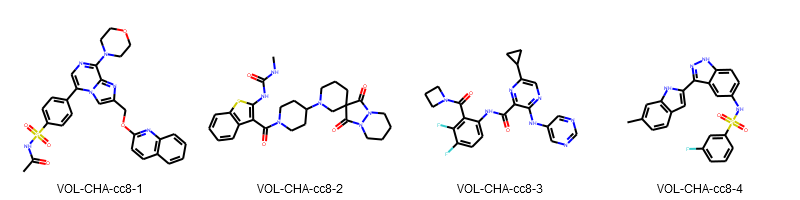
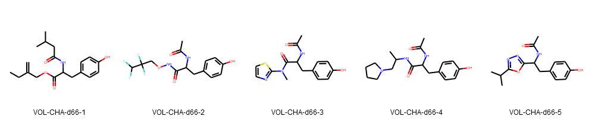

# Fight SARS-CoV-2 strategy for postera contribution (started 25.03.2020)

_Powered by: [Volkamer lab](http://volkamerlab.org/)_

This is part of a community effort to rapidly find new hits to target the virus main protease.

## Background
The COVID-19 (coronavirus disease 2019) pandemic, caused by severe acute respiratory syndrome coronavirus 2 (SARS-CoV-2) has become a global health emergency. With no current evidence for specific antiviral treatment, there is an urgent need for effective anti-COVID drugs ([more about potential drugs and clinical trials in the COVID-19 Science Report: Therapeutics](https://sph.nus.edu.sg/wp-content/uploads/2020/03/COVID-19-Science-Report-Therapeutics-30-Mar.pdf)). A promising target is the main protease Mpro of SARS-CoV-2 for which the first [crystal structure](http://www.rcsb.org/structure/6LU7) has been determined in January 2020.
[UK’s Diamond Light Source](https://www.diamond.ac.uk/covid-19/for-scientists/Main-protease-structure-and-XChem/Downloads.html) performed a large crystal-based fragment screen on Mpro. In collaboration with [PostEra](https://covid.postera.ai/covid) and others, they encourage researchers from around the world to use their fragment hits as a starting point and contribute, amongst others, by suggesting potential inhibitors (effective and easy-to-make).

References:

* Jin, Zhenming, _et al._ "Structure-based drug design, virtual screening and high-throughput screening rapidly identify antiviral leads targeting COVID-19." bioRxiv (2020). [DOI: `10.1101/2020.02.26.964882`](https://www.biorxiv.org/content/10.1101/2020.02.26.964882v1)
* Zhang, Linlin, _et al._ "Crystal structure of SARS-CoV-2 main protease provides a basis for design of improved α-ketoamide inhibitors." Science (2020). [DOI: `10.1126/science.abb3405`](https://science.sciencemag.org/content/early/2020/03/20/science.abb3405)
* Lai, Chih-Cheng, _et al._ "Severe acute respiratory syndrome coronavirus 2 (SARS-CoV-2) and corona virus disease-2019 (COVID-19): the epidemic and the challenges." International journal of antimicrobial agents (2020): 105924. [DOI: `10.1016/j.ijantimicag.2020.105924`](https://www.sciencedirect.com/science/article/pii/S0924857920300674?via%3Dihub)

## Proposed pipelines

In the following two strategies for finding new compounds fitting the needs of the challenge are proposed.

Note for setting up the pipeline, 5 known [protease inhibitors](data/proteaseFDAdrugs_3D.sdf) were used as toy examples. Thus, the scripts and notebooks in code might still refer to them.

### Strategy A: Docking

A rational structure-based approach to select screening compounds was investigated. Therefore, similar binding site for COVID-19 main protease were searched (structure-based, using [ProBis](http://probis.cmm.ki.si/)), and the active compounds for the similar protein were collected from [ChEMBL](https://www.ebi.ac.uk/chembl/).
Furthermore, due to time-constraints, the [focused library](code/focused_library_similar_proteins/README.md) was filtered with to keep the compounds having some resemblance with the 22 non-covalent fragments (using MCS).

A representative set of three structures, Mpro-x0387, Mpro-x0946, Mpro-x0967, were then chosen to [run multiple dockings](code/docking/README.md) with the filtered library using the docking program, smina.

Based on the docking scores, toxicity criteria (trying to avoid respiratory toxicity using estimations from [eMolTox](http://xundrug.cn/moltox) webserver) and after visual inspection these compounds were selected (ChEMBL IDs)
* CHEMBL3937948
* CHEMBL2059095
* CHEMBL3690047
* CHEMBL1684519 

Note that similar molecules are available in Enamine REAL, such a selection could be added here later (time restriction for now, pipeline available, see strategy B). 

### Strategy B: Growing

Here a structure-based approach was used for building on the complexes of different fragments bound against the virus main protease available from DiamondX.

As starting point in this example, fragment **Mpro-x0967** was chosen based on its size, its match in our focused library (see [strategy A](A-focused_library_docking_screening_pipeline/README.md)) and its good estimated affinity using [BioSolveIT's SeeSAR](https://www.biosolveit.de/SeeSAR/)).

[SeeSAR](https://www.biosolveit.de/SeeSAR/) was then used to grow the fragment choosing a bond towards the bromide tail.

To guarantee synthetic accessibility, similar compounds within Enamine [REALspace](https://www.biosolveit.de/CoLibri/spaces.html#realspace) were searched using [FTrees](https://www.biosolveit.de/FTrees/).The found compounds (no duplicates in current postera submissions, 31.03.2020) were cluster to find a diverse subset an the remaining compounds were redocked using SeeSAR.

Based on the fit and the estimated binding affinity the final molecules were selected.

## Repository structure

- `A-focused_library_docking_screening_pipeline/` contains the results for our strategy A.
- `B-fragment_growing_pipeline/` contains the results for the strategy B.
- `code/`: scripts and notebooks developed to support obtaining the results in both strategies.
- `data/`: raw data that either can be taken as input in the strategies, or are a byproduct of the pipeline.
- `devtools/`: metadata files to reproduce the development environment the strategies needed.

## Resources

<!-- AV: List proposed outputs here. -->

### Available data and methods
<!-- AV: Moved 'Available data and methods' to resources for now, so its out of the way. -->
<!-- JRG: Summarize in # Resources -->

1. Input data: Collected input molecules for screening pipeline
    * Approved [protease inhibitors](https://github.com/volkamerlab/covid19-SBapproach/blob/master/data/proteaseFDAdrugs.csv) (taken from http://dx.doi.org/10.17179/excli2020-1189)
    * SARS-CoV-2 [main protease focused ChEMBL subset](https://github.com/volkamerlab/covid19-SBapproach/tree/master/data/focused_library_similar_proteins) using binding site comparison
    * Fragments from [DiamondX](https://www.diamond.ac.uk/covid-19/for-scientists/Main-protease-structure-and-XChem/Downloads.html)
        * [Non-covalent hits](data/fragments/non_covalent_fragments_2D.sdf) in the active site
        * [Covalently-bound hits](data/fragments/covalent_fragments_2D.sdf) in the active site
    * Current [postera](https://covid.postera.ai/covid) submissions ([24 march 2020 version](data/covid_submissions_03_24_2020.xlsx))
2. Scripts and methods used for the pipelines
    * [Main protease focused ChEMBL subset](code/focused_library_similar_proteins/README.md)
        * Structure-based binding site comparison using [ProBis](http://probis.cmm.ki.si/)
        * Querying ligands from [ChEMBL](https://www.ebi.ac.uk/chembl/) known to bind to these similar proteins
    * Scripts for compound preprocessing and filtering
        * `code/utils/`: compound preprocessing 
        * Notebooks to:
            * Generate [3D conformations](code/generate_3d_coordinates.ipynb)
            * Filter by [similarity to fragments](code/filter_screeningdeck_by_fragment_similarity.ipynb)
            * Select [divers subset](code/compound_clustering/compound_clustering.ipynb)
    * [Docking](code/docking/README.md): Dock selected compounds to target ensemble using [smina](https://sourceforge.net/projects/smina)
    * DiamondX fragment growing
    *   [Ftrees](code/ftrees/README.md): Explore available compounds in REAL space (Availability by Enamine)

#### Main contributors

_Yonghui Chen, Dominique Sydow, Jaime Rodríguez-Guerra, Andrea Morger and Andrea Volkamer_
