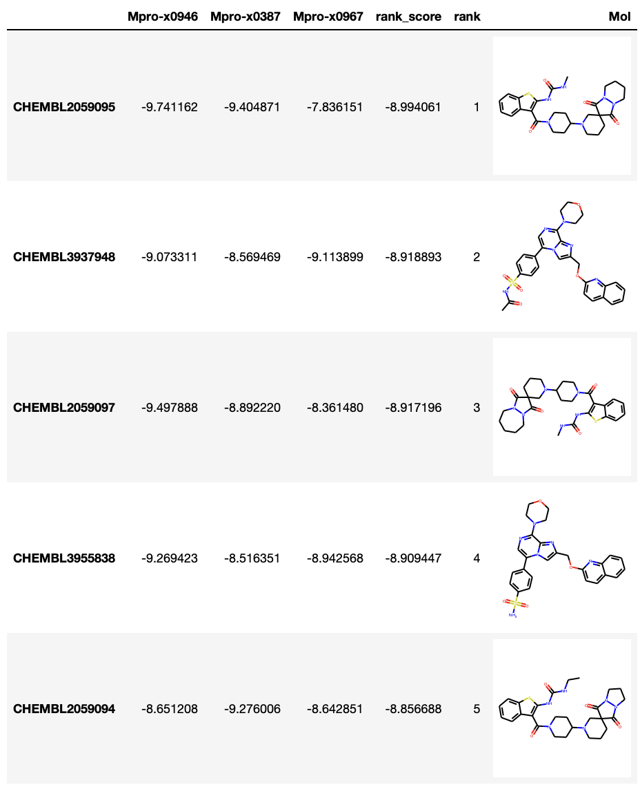
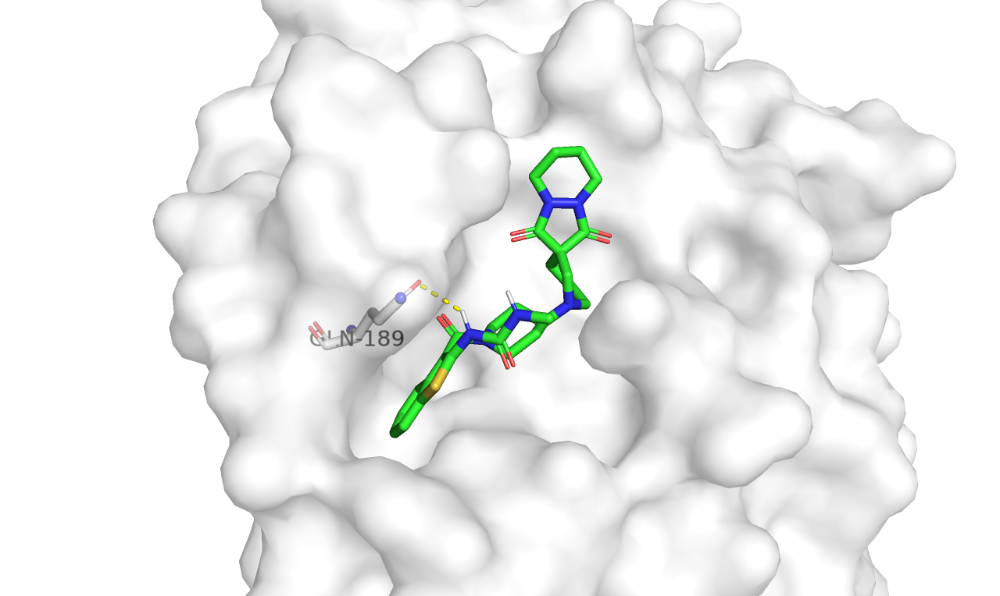

## Docking screening for focused library filtered from similar proteins
In this pipeline, a docking-based screening will be implemented with the SARS-CoV-2 focused ChEMBL libarary, which filtered from similar protiens, to search the hit compounds.

Firstly, the focused library will be generated [here](https://github.com/volkamerlab/covid19-SBapproach/tree/master/code/focused_library_similar_proteins).
Next, the focused library will be filtered by the maximum common substructure (MCS) fragment strategy. Only those molecules having some resemblance with the original fragments will be choosed (See [here](https://github.com/volkamerlab/covid19-SBapproach/tree/master/notebooks/filter_screeningdeck_by_fragment_similarity.ipynb)).
Finally, the docking-based screening will be applied to the filtered library (See [here](https://github.com/volkamerlab/covid19-SBapproach/tree/master/code/docking)).

### Pipeline
1. Generate the SARS-CoV-2 focused ChEMBL library. It locates [here](https://github.com/volkamerlab/covid19-SBapproach/tree/master/data/focused_library_similar_proteins/focused_library.csv).
2. Filter the focused library with the MCS fragment strategy.
    * Choose the focused library as screening deck. There are 4121 compounds in the library.
    * Choose the 22 [non-covalent fragments](https://github.com/volkamerlab/covid19-SBapproach/tree/master/data/fragments/non_covalent_fragments2D.sdf) as fragment set.
    
    * Get MCS between compounds and fragments and store the best-match fragment for per compound.
    
    * Store dataset filtered by similarity to fragment or MCS with fragment.
      * Set the cut-off = 0.75 for the similarity filtering.

        In this case, 916 compounds are filtered.
        ```
        mcsFragName   number
        Mpro-x0995    760
        Mpro-x0305     83
        Mpro-x0107     45
        Mpro-x0387     37
        Mpro-x0946     35
        Mpro-x0967      1
        ```
      * Control the number of compounds and receptor structures.
        * Compounds

            For the mcs fragments which match more than 50 compounds, they usually are small fragment.

            We control the number of compounds for each mcs fragments no more than 50.

        * Receptor structures

            Because of resource-saving, only three strutures were choosed for molecular docking.

            The corresponding fragment ligands for the choosed structures should be big enough and bind with receptor in different subpockets.

            For this pipeline, They are "Mpro-x0387", "Mpro-x0946", "Mpro-x0967".
            
3. Molecular docking  screening.
   * Docking program: Smina
   * Results analyse:
     * The top 5 compounds in docking screening:
            

        Question:

        Some of the top compounds are similar. In this  situation, it's necessary to cluster and reduce the screening deck before docking.

     *  The pose of the top 1 comppounds, "CHEMBL2059095", in structure "Mpro-x0946":
            


