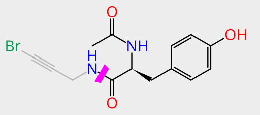
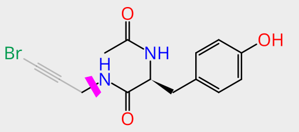

## Fragment growing strategy

Fragment growing using [SeeSAR](https://www.biosolveit.de/SeeSAR/) software

First, a fragment will be selected and second it will be grown. 
Next, the pipeline as described before will be evoked to find similar compounds ready to be synthesized in Enamine REAL space and post-processed (depending on number of hits).

            

### Pipeline

1. Fragment choice
    * 22 non-covalent fragments binding to the virus main protease available from [DiamondX](https://www.diamond.ac.uk/covid-19/for-scientists/Main-protease-structure-and-XChem/Downloads.html) 
    * Fragment **Mpro-x0967** was chosen as starting point
        * based on its size
        * and its match in our focused library (see docking part)
    * Fragment [**Mpro-x0967**](result_data/x0967_seesar.sdf) shows good estimated affinity in the range of 189.26 - 18804.12 [nM]
        * co-crystallized fragment refined using template docking mode
        * 3 hydrogen bonds to HIS 163 and 2 * GLU 166  

2. Fragment growing
    * Software and libraries
        * [SeeSAR](https://www.biosolveit.de/SeeSAR/) software was used for fragment growing 
        * [Recore index](https://www.biosolveit.de/SeeSAR/recore-indices/) (based on ZINC) is used for fragment growing
    * Growing based on selecting one bond to cut
        * Inspirations for growing the Bromide tail tried
            * cut at between NH and C=O bond: {width=15%}
            * cut after NH: 
        * [5 top molecules](result_data/x0967_seesar_inspirations_top5.sdf) created with a lower estimated affinity (Note [top 20](result_data/x0967_seesar_inspirations_top5.sdf) also available)

3. Find most similar compounds within Enamine REAL using Ftrees
    * [5 top molecules](result_data/x0967_seesar_inspirations_top5.sdf) and the initial fragment itself are used as input
    * A maximum of 100 new compounds per molecule generated as shown [here](./ftrees_for_top5_compounds_and_combine_data.ipynb) 
    * Resulting 600 [molecules](result_data/x0967_top5_inspirations_out_enamineREAL_combined.sdf)

4. [TODO] Postprocessing
    * Check for duplicates in current submissions
    * Cluster results to select diverse set
    
5. [TODO] Final selection of ~ 5 compounds
    * (Re)dock final molecules

6. [TODO] Collect info for submission
    * Provide Smiles/structures
    * Describe rationale
    * Include fragment IDs

    

